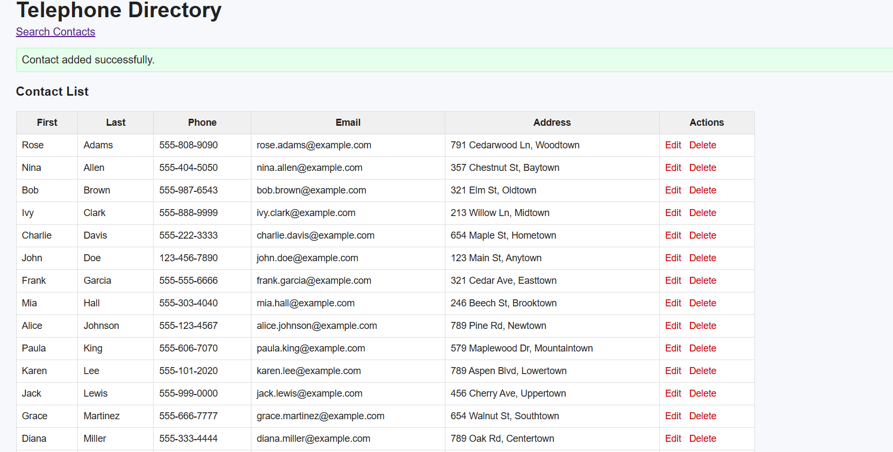
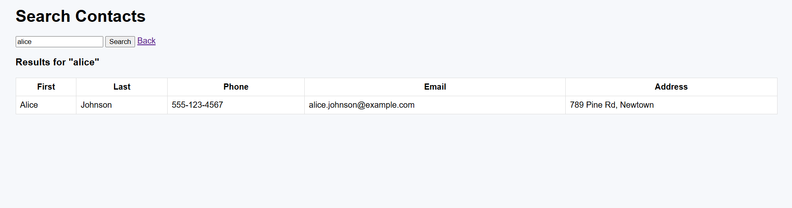

📞 Telephone Directory Management System

A simple web-based contact management application built using Python Flask and MySQL.
It allows users to add, view, edit, delete, and search contacts through a clean and user-friendly interface.

📸 Screenshots
🖼️ Homepage (All Contacts)

🖼️ Add / Edit Contact Page

🚀 Features

➕ Add new contacts

📝 Edit existing contacts

❌ Delete contacts

🔍 Search contacts by first name, last name, or phone number

📋 View all contacts in a clean table

🗄️ MySQL database backend

⚡ Fast searching with indexed columns

🌐 Browser-based web application (Flask + HTML templates)

🛠️ Tech Stack

| Layer    | Technology                         |
| -------- | ---------------------------------- |
| Frontend | HTML, CSS (Flask Jinja2 Templates) |
| Backend  | Python (Flask Framework)           |
| Database | MySQL                              |
| Tools    | VS Code, MySQL Workbench, Chrome   |

📁 Project Structure

telephonedirectory/
├── app.py                # Flask backend server

├── config.py             # MySQL connection via .env variables

├── database.sql          # SQL script for database setup

├── .env                  # Hidden file (database credentials)

├── .gitignore            # Prevents uploading sensitive files

└── templates/

       ├── index.html     # Homepage (list + add contact)

       ├── search.html    # Search contact page

       └── edit.html      # Edit contact page

🧵 Installation & Setup
1️⃣ Clone the Repository
git clone https://github.com/YOUR_USERNAME/TelephoneDirectory.git
cd TelephoneDirectory

2️⃣ Install Dependencies
pip install flask mysql-connector-python python-dotenv

3️⃣ Setup MySQL Database

Open MySQL Workbench → run database.sql.

This script will:

Create the database

Create the Contacts table

Insert 20 sample records

Create an index for fast searching

🔐 Environment Variables

Create a .env file (DO NOT upload this file):

DB_HOST=localhost
DB_USER=root
DB_PASS=yourpassword
DB_NAME=TelephoneDirectory

▶️ Running the Application

Start the Flask server:

python app.py

Open the application in a browser:

http://127.0.0.1:5000/

🔍 Search Algorithm

Search is implemented using SQL wildcard matching:

SELECT * FROM Contacts
WHERE first_name LIKE '%query%'
   OR last_name LIKE '%query%'
   OR phone_number LIKE '%query%';

MySQL uses B-Tree indexes, making search fast and efficient.

Author 
Snigdha 

